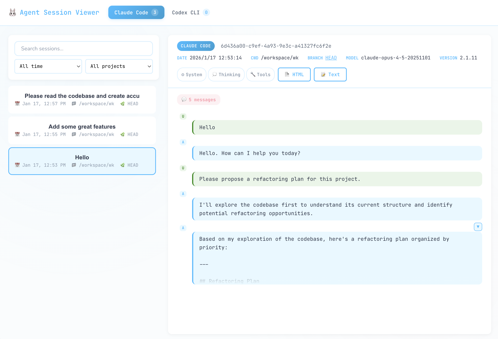

# Agent Session View

[English](./README.md)

基于 Web 的会话查看器，用于浏览、查看和导出 **Claude Code** 与 **Codex CLI** 的对话历史。

## 功能特性

- **统一会话浏览器**：在单一界面中查看 Claude Code 和 Codex CLI 的所有会话，按时间戳降序排列
- **丰富的会话元数据**：查看会话 ID、时间戳、工作目录、Git 分支、模型名称和 CLI 版本
- **完整对话历史**：浏览包含用户消息、助手回复、工具调用和思考块的完整对话记录
- **灵活的消息过滤**：切换显示/隐藏系统消息、思考块、工具调用/结果和 Skill 调用完整内容
- **分支视图**：按时间顺序查看与某个 Git 分支关联的所有会话
- **多种导出格式**：
  - **纯文本**：简洁可读的文本格式
  - **样式化 HTML**：带颜色编码、可折叠长内容、响应式设计的 HTML 文件
  - **Markdown**：带代码围栏块的结构化 Markdown 文件
- **批量导出**：一键导出所有会话到本地目录，按项目子目录分类
- **Skill 调用支持**：解析并展示 Skill 调用消息，包含用户输入和可选的完整内容

## 截图



## 安装

```bash
git clone https://github.com/dotneet/agent-session-view.git
cd agent-session-view
bun install
```

## 快速开始

```bash
# 启动 Web 服务器
bun run start

# 开发模式（支持热模块替换）
bun run dev
```

在浏览器中访问 http://localhost:3456。

## Web 界面

- **会话列表**：支持实时搜索和过滤的会话浏览
- **搜索**：按关键词过滤会话
- **日期过滤**：按今天、昨天、本周、上周、本月或全部时间过滤
- **项目过滤**：按工作目录过滤会话
- **会话详情视图**：查看完整对话历史，可切换消息类型的显示
- **分支视图**：点击分支名称查看所有相关会话（按时间合并）
- **导出**：将单个会话下载为 HTML、文本或 Markdown 格式
- **全量导出**：批量导出所有会话到 `./exported/` 目录，按项目分类

### API 接口

| 接口 | 方法 | 描述 |
|------|------|------|
| `/api/sessions` | GET | 获取会话列表，支持可选过滤条件 |
| `/api/sessions/:agentType/:sessionId` | GET | 获取会话详情 |
| `/api/sessions/branch` | GET | 获取某 Git 分支的所有会话 |
| `/api/projects` | GET | 获取项目列表（工作目录） |
| `/api/export` | POST | 导出单个会话 |
| `/api/export/all` | POST | 批量导出所有会话到本地目录 |
| `/api/export/branch` | POST | 导出分支视图 |

## 导出

### 单个会话导出

直接从浏览器下载。文件命名规则：`{agentType}--{YYYY-MM-DD}--{session_id}.{ext}`

### 批量导出

导出到 `./exported/all-sessions-{timestamp}/` 目录，按项目子目录分类。

### 导出选项

| 选项 | 默认值 | 描述 |
|------|--------|------|
| 用户消息 | 启用 | 包含用户输入消息 |
| 助手消息 | 启用 | 包含助手回复 |
| 工具调用 | 禁用 | 包含工具调用及结果 |
| 思考块 | 禁用 | 包含思考/推理块 |
| 系统消息 | 禁用 | 包含系统提醒消息 |
| Skill 完整内容 | 禁用 | 包含 Skill 调用消息的完整内容 |

### HTML 导出特性

- 按消息类型着色（用户、助手、工具调用、工具结果、思考块）
- 可折叠的长消息（超过 800 字符自动折叠）
- 连续助手消息分组，支持展开/折叠
- Skill 调用消息的解析展示
- 响应式设计，支持移动端查看
- 适合打印的 CSS 样式

## 支持的会话数据

### Claude Code 会话
- 用户消息
- 助手文本回复
- 工具调用（含输入参数）
- 工具结果（截断至 500 字符）
- 扩展思考块
- Skill 调用消息

### Codex CLI 会话
- 用户消息
- 助手回复
- 函数调用（含参数）
- 函数调用输出
- 推理块

## 开发

详细的开发环境配置和开发指南请参阅 [DEVELOPER.md](./DEVELOPER.md)。

## 许可证

MIT
